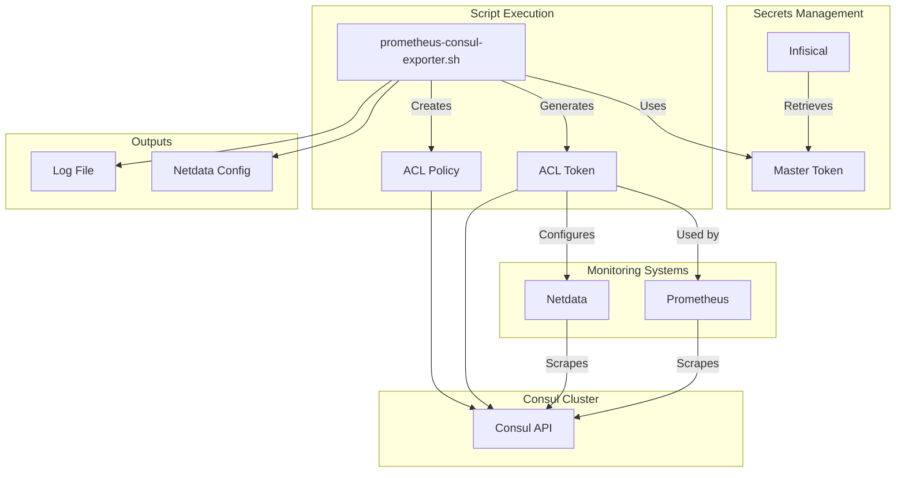

# 🔐 Prometheus Consul Exporter Setup


Automated setup script for configuring Consul ACL policies and tokens to enable secure metrics scraping by Prometheus and Netdata. This script integrates with Infisical for secure secrets management and provides a streamlined approach to setting up Consul monitoring.

## Table of Contents

1. [Overview](#overview)
1. [Architecture](#architecture)
1. [Prerequisites](#prerequisites)
1. [Installation](#installation)
1. [Usage](#usage)
1. [Command Line Options](#command-line-options)
1. [Configuration Details](#configuration-details)
1. [Integration Guide](#integration-guide)
1. [Security Considerations](#security-considerations)
1. [Troubleshooting](#troubleshooting)
1. [Example Outputs](#example-outputs)
1. [References](#references)

## Overview

The Prometheus Consul Exporter Setup script automates the process of:

- Creating Consul ACL policies with appropriate read permissions
- Generating secure ACL tokens for monitoring systems
- Configuring Netdata's Consul collector with the generated token
- Validating connectivity and permissions
- Providing secure token storage and audit trails

### Key Features

- **Automated ACL Management**: Creates policies and tokens with minimal permissions
- **Infisical Integration**: Secure retrieval of Consul management tokens
- **Netdata Auto-Configuration**: Automatically configures Netdata's go.d Consul plugin
- **Security-First Design**: Follows principle of least privilege for monitoring access
- **Idempotent Operations**: Safe to run multiple times
- **Comprehensive Logging**: Detailed audit trail of all operations

### Use Cases

- Setting up monitoring for Consul clusters
- Enabling Prometheus to scrape Consul metrics
- Configuring Netdata for real-time Consul monitoring
- Automating secure token distribution for monitoring infrastructure

## Architecture



## Prerequisites

### Required Tools

- **Consul CLI**: Must be installed and accessible in PATH
  - Installation: [Consul Downloads](https://www.consul.io/downloads)
  - Version: 1.10+ recommended for full ACL support

- **Infisical CLI**: For secure secrets management
  - Installation: `brew install infisical/get-cli/infisical`
  - Alternative: [Infisical Documentation](https://infisical.com/docs/cli/overview)

- **jq**: JSON processing utility
  - Installation: `sudo apt-get install jq` or `brew install jq`

- **Root/sudo access**: Required for Netdata configuration (can be skipped with `--skip-netdata`)

### Infisical Requirements

- Authenticated to Infisical: `infisical login`
- Access to the `apollo-13` project
- Read permission for `/apollo-13/consul/CONSUL_MASTER_TOKEN`

### Consul Requirements

- Consul cluster with ACLs enabled
- Network access to Consul API (default: http://127.0.0.1:8500)
- Management token with ACL write permissions

### Optional: Netdata

- Netdata installed with go.d plugin support
- Typically installed in `/etc/netdata` or `/opt/netdata/etc/netdata`

## Installation

### 1. Clone the Repository

```bash
git clone https://github.com/basher83/automation-scripts.git
cd automation-scripts/consul/prometheus
```

### 2. Make Script Executable

```bash
chmod +x prometheus-consul-exporter.sh
```

### 3. Verify Prerequisites

```bash
# Check required tools
command -v consul || echo "Consul CLI not found"
command -v infisical || echo "Infisical CLI not found"
command -v jq || echo "jq not found"

# Verify Infisical authentication
infisical secrets list --path="/apollo-13/consul"
```

## Usage

### Basic Usage

```bash
# Run with default settings (interactive mode)
sudo ./prometheus-consul-exporter.sh
```

### Advanced Usage Examples

```bash
# Force recreation of existing policies/tokens
sudo ./prometheus-consul-exporter.sh --force

# Skip Netdata configuration (token only)
./prometheus-consul-exporter.sh --skip-netdata

# Non-interactive mode for automation
sudo ./prometheus-consul-exporter.sh --non-interactive

# Custom Consul address
sudo ./prometheus-consul-exporter.sh --consul-addr https://consul.example.com:8501

# Combine options
sudo ./prometheus-consul-exporter.sh --force --non-interactive --consul-addr http://10.0.0.10:8500
```

### CI/CD Integration

```bash
# Automated deployment example
export CONSUL_ADDR="http://consul.internal:8500"
sudo ./prometheus-consul-exporter.sh \
  --non-interactive \
  --consul-addr "$CONSUL_ADDR" \
  --skip-netdata
```

## Command Line Options

| Option | Description | Default |
|--------|-------------|---------|
| `--force` | Force recreation of existing policies and tokens | false |
| `--skip-netdata` | Skip Netdata configuration, only create token | false |
| `--non-interactive` | Run without prompts (for automation) | false |
| `--consul-addr URL` | Custom Consul address | http://127.0.0.1:8500 |
| `--help` | Show help message and exit | - |

## Configuration Details

### ACL Policy Created

The script creates a policy named `prometheus-scraping` with the following permissions:

```hcl
# Policy for Prometheus/Netdata scraping
operator = "read"

node_prefix "" {
  policy = "read"
}

agent_prefix "" {
  policy = "read"
}

service_prefix "" {
  policy = "read"
}
```

This policy provides read-only access to:
- Operator endpoints (cluster information)
- All node information
- All agent metrics
- All service registrations

### Netdata Configuration

When Netdata configuration is enabled, the script creates:

**File**: `/etc/netdata/go.d/consul.conf` (or `/opt/netdata/etc/netdata/go.d/consul.conf`)

```yaml
jobs:
  - name: local
    url: http://127.0.0.1:8500
    acl_token: "<generated-token>"
    update_every: 1
    timeout: 2
    autodetection_retry: 0
    collect_node_metadata: yes
    collect_service_metadata: yes
```

### Log File

All operations are logged to: `/var/log/consul-prometheus-setup.log`

The log includes:
- Timestamp for each operation
- Policy creation details
- Token generation information
- Token SecretID (with restricted file permissions)
- Any errors or warnings

## Integration Guide

### Prometheus Configuration

Add the following job to your `prometheus.yml`:

```yaml
scrape_configs:
  - job_name: 'consul'
    consul_sd_configs:
      - server: 'consul.example.com:8500'
        token: '<generated-token>'
        datacenter: 'dc1'
    relabel_configs:
      - source_labels: [__meta_consul_service]
        target_label: service
      - source_labels: [__meta_consul_node]
        target_label: node
    metrics_path: '/v1/agent/metrics'
    params:
      format: ['prometheus']
    scheme: 'http'
    authorization:
      type: 'Bearer'
      credentials: '<generated-token>'
```

### Netdata Integration

After running the script, Netdata will automatically:
1. Load the new Consul configuration
2. Start collecting metrics from Consul
3. Display metrics in the Netdata dashboard under "Consul"

Access Netdata metrics at: `http://localhost:19999`

### Grafana Dashboards

Recommended Grafana dashboards for Consul metrics:
- [Consul Server Monitoring](https://grafana.com/grafana/dashboards/13396)
- [Consul Services Dashboard](https://grafana.com/grafana/dashboards/13397)

## Security Considerations

### Token Security

- Tokens are stored with restricted permissions (640)
- Log files containing tokens are access-controlled
- Consider rotating tokens periodically
- Use TLS for Consul API connections in production

### ACL Best Practices

- The script follows principle of least privilege
- Only read permissions are granted
- No write or delete capabilities
- Tokens are service-specific (not management tokens)

### Infisical Security

- Master token is never written to disk in plain text
- Retrieved only when needed and cleared from memory
- Ensure Infisical access is properly restricted

### Network Security

- Use `--consul-addr` with HTTPS in production
- Consider network segmentation for monitoring systems
- Implement firewall rules to restrict API access

## Troubleshooting

### Common Issues

#### 1. Infisical Authentication Failed

**Error**: "Not authenticated to Infisical or missing access to apollo-13 project"

**Solution**:
```bash
# Authenticate to Infisical
infisical login

# Verify access
infisical secrets list --path="/apollo-13/consul"
```

#### 2. Consul Connection Failed

**Error**: "Cannot connect to Consul at <address>"

**Solution**:
```bash
# Check Consul is running
systemctl status consul

# Verify API accessibility
curl -s http://127.0.0.1:8500/v1/status/leader

# Check firewall rules
sudo ufw status
```

#### 3. Policy Already Exists

**Error**: "Policy 'prometheus-scraping' already exists"

**Solution**:
```bash
# Use force mode to recreate
sudo ./prometheus-consul-exporter.sh --force

# Or manually delete the policy
consul acl policy delete -name prometheus-scraping
```

#### 4. Netdata Not Found

**Error**: "Netdata configuration directory not found"

**Solution**:
```bash
# Skip Netdata configuration
./prometheus-consul-exporter.sh --skip-netdata

# Or install Netdata first
bash <(curl -Ss https://my-netdata.io/kickstart.sh)
```

### Debug Mode

For detailed troubleshooting:

```bash
# Enable bash debug mode
bash -x ./prometheus-consul-exporter.sh

# Check the log file
sudo cat /var/log/consul-prometheus-setup.log

# Verify token permissions
consul acl token read -id <token-accessor-id>
```

## Example Outputs

### Successful Execution

```
[INFO] Starting Consul Prometheus exporter setup...
[INFO] Script: prometheus-consul-exporter.sh
[INFO] Consul address: http://127.0.0.1:8500
[WARN] This script will:
  1. Create Consul ACL policy: prometheus-scraping
  2. Generate a new ACL token for Prometheus/Netdata
  3. Configure Netdata to use the token

Continue? [y/N] y
[INFO] Retrieving Consul management token from Infisical...
[SUCCESS] Successfully retrieved Consul management token
[INFO] Verifying Consul connectivity...
[SUCCESS] Successfully connected to Consul
[INFO] Creating Consul ACL policy: prometheus-scraping
[SUCCESS] ACL policy 'prometheus-scraping' created successfully
[INFO] Creating Consul ACL token for Prometheus scraping...
[SUCCESS] ACL token created successfully
[INFO] Token SecretID saved to: /var/log/consul-prometheus-setup.log (restricted access)
[INFO] Configuring Netdata Consul collector...
[INFO] Writing Netdata Consul configuration...
[SUCCESS] Netdata configuration updated
[INFO] Configuration file: /etc/netdata/go.d/consul.conf
[INFO] Restarting Netdata service...
[SUCCESS] Netdata restarted

[SUCCESS] 🎉 Consul Prometheus exporter setup complete!

[INFO] Next steps:
  1. Verify ACL policy: consul acl policy read -name prometheus-scraping
  2. Check Consul metrics endpoint: curl -H "X-Consul-Token: <token>" http://127.0.0.1:8500/v1/agent/metrics
  3. Verify Netdata is collecting metrics: check Netdata dashboard
  4. Review setup log: sudo cat /var/log/consul-prometheus-setup.log
```

### Verification Commands

```bash
# Verify policy creation
consul acl policy read -name prometheus-scraping

# Test metrics endpoint with token
TOKEN=$(sudo grep "SecretID:" /var/log/consul-prometheus-setup.log | tail -1 | awk '{print $2}')
curl -H "X-Consul-Token: $TOKEN" http://127.0.0.1:8500/v1/agent/metrics?format=prometheus | head -20

# Check Netdata is collecting data
curl -s http://localhost:19999/api/v1/data?chart=consul.client_rpc | jq .
```

## References

### Documentation

- [Consul ACL System](https://www.consul.io/docs/security/acl)
- [Consul Telemetry](https://www.consul.io/docs/agent/telemetry)
- [Prometheus Consul Integration](https://prometheus.io/docs/prometheus/latest/configuration/configuration/#consul_sd_config)
- [Netdata Consul Collector](https://learn.netdata.cloud/docs/collecting-metrics/go.d.plugin/modules/consul)
- [Infisical CLI Documentation](https://infisical.com/docs/cli/overview)

### Related Scripts

- [Bootstrap Script](../../bootstrap/README.md) - Install modern CLI tools
- [CheckMK Agent Installation](../../checkmk/README.md) - Monitoring agent setup

### Community Resources

- [Consul Community Forum](https://discuss.hashicorp.com/c/consul)
- [Prometheus Community](https://prometheus.io/community/)
- [Netdata Community](https://community.netdata.cloud/)